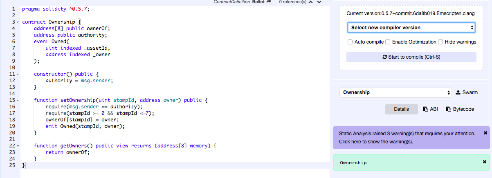
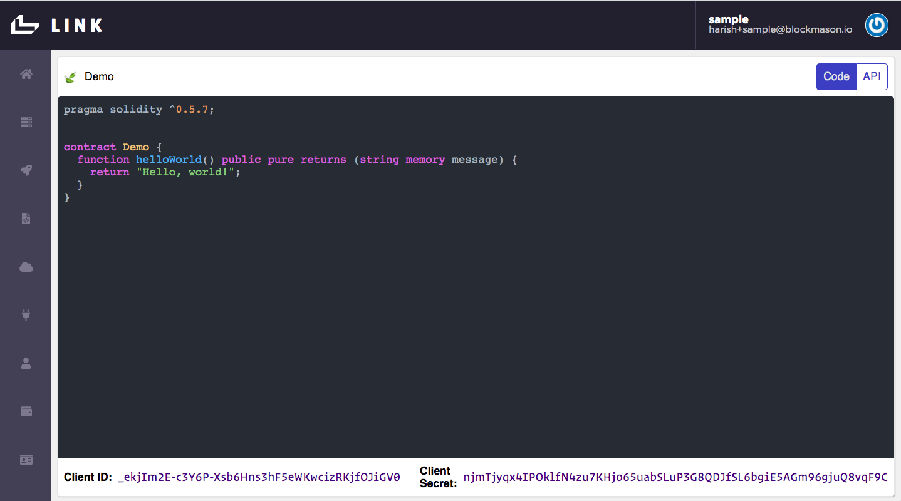
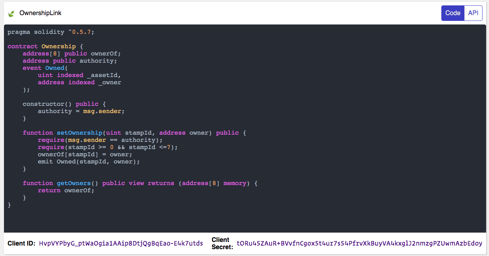
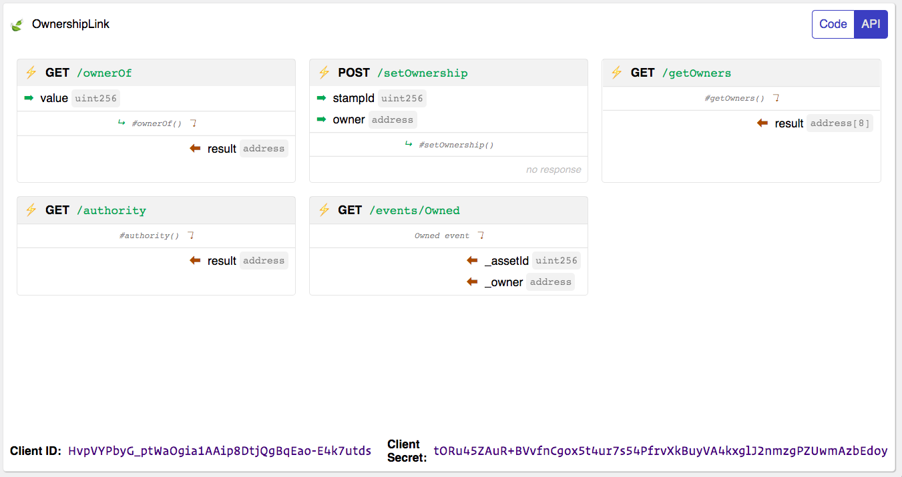

# Introduction to Smart Contracts and Blockmason Link
## Goal
In this activity, we will learn about Smart Contract design and use Link to deploy smart contracts and their create their corresponding APIs. 

## Exercise
This activity will require you to:
* Use Solidity (https://solidity.readthedocs.io/en/v0.5.7/) to create a basic 'Ownership' smart contract
* Use Remix (https://remix.ethereum.org) to test and validate the smart contract
* Use Link (https://mason.link) to interact with the smart contract on the Link private network

## General activity notes
* It is expected workshop participants have some familiarity with Solidity. This workshop will primarily cover 'types' of Solidity objects (https://solidity.readthedocs.io/en/v0.5.7/types.html)
* A dedicated `getOwners()` function is used instead of the automatic getter that comes with the public declaration of the array variable `ownerOf` because the latter requires an array index to be passed to return a single value whereas the former will return the entire array.
* The Link private network is Link's own internal blockchain. The terms network and blockchain will be used in an interchangeable context. 

### Setup
> Ensure you have registered for a Link account at https://mason.link (email required)

### Smart Contract Design
* The types of Solidity objects, in particular:
  * `uint`, `string`, `address` & `address payable`, `msg.sender`
  * Mapping vs. Array
  * Struts
  * `public` keyword and getters
* `require` keyword
* `memory` vs `storage` (https://medium.com/coinmonks/ethereum-solidity-memory-vs-storage-which-to-use-in-local-functions-72b593c3703a)
* Security Considerations (Open up `contract_security.md`)
  * Private information and randomness
  * Re-entrancy
  * Checks-Effects-Interactions pattern
  * Underflows / Overflows
  * Take compiler warnings seriously!
* Use of an 'authority' to sign off on transactions
* Events (https://solidity.readthedocs.io/en/v0.5.7/contracts.html#events)

### Create 'Ownership' Smart Contract
> Copy the following smart contract code into the Remix browser IDE for this part of the exericse.

The skeleton of the Ownership contract is:
```
pragma solidity ^0.5.7;

contract Ownership {
	// Add some state variables

    constructor() public {
        // Default constructor
    }

    function setOwnership(uint stampId, address owner) public {
        // Set ownership
    }

    function getOwners() public view returns (address[8] memory) {
        // Return owners array
    }
}
```

First, we want to access the list of owners for a type of asset, say collectible stamps. The array index will refer to the asset identifier and the value will be the owner's wallet address. For this example, assume only 8 assets will be owned. 

> Add the public `ownerOf` state variable and return it in the `getOwners()` function.
```
pragma solidity ^0.5.7;

contract Ownership {
    address[8] public ownerOf;

    constructor() public {
        // Default constructor
    }

    function setOwnership(<pass some arguments here>) public {
        // Set ownership
    }

    function getOwners() public view returns (address[8] memory) {
	return ownerOf;
    }
}
```
Note - the `address[8]` defines an array of length 8 of type `address`. The `public` keyword makes it externally accessible through an automatically created getter. However, one cannot retrieve the entire array at once but rather must pass an index value to retrieve a single value (e.g. call `ownerOf(1)`). 

To get around this getter limitation, we create a `getOwners()` function and specify the return value to be of type `address[8]`. This allows us to return the entire `ownerOf` array. 

> Next, let's complete the `setOwnership(...)` function. We want to assign a particular stamp ID to an owner address. Additionally, we want to check that the stamp ID is within the array size limits. 
```
function setOwnership(uint stampId, address owner) public {
        require(stampId >= 0 && stampId <=7);
        ownerOf[stampId] = owner;
    }
```

> Then, we want to set an 'authority' address that initially creates the smart contract and also calls and executes the smart contract functions. For testing in this exercise, we also want to make this authority address publicly available.
```
pragma solidity ^0.5.7;

contract Ownership {
    address[8] public ownerOf;
    address public authority;

    constructor() public {
        authority = msg.sender;
    }

    function setOwnership(uint stampId, address owner) public {
        require(msg.sender == authority);
        require(stampId >= 0 && stampId <=7);
        ownerOf[stampId] = owner;
    }

    function getOwners() public view returns (address[8] memory) {
        return ownerOf;
    }
}
```
Lastly, we want to add an **event emitter** to the `setOwnership` function so that we are told when ownership has been set. Refer to https://solidity.readthedocs.io/en/v0.5.7/contracts.html#events for more details on events.

> Create an `Owned` event object attribute of the Ownership contract that takes in the assetId and ownership address. Emit this event at the end of the `setOwnership` function. 
```
pragma solidity ^0.5.7;

contract Ownership {
    address[8] public ownerOf;
    address public authority;
    event Owned(
        uint indexed _assetId,
        address indexed _owner
    );

    constructor() public {
        authority = msg.sender;
    }

    function setOwnership(uint stampId, address owner) public {
        require(msg.sender == authority);
        require(stampId >= 0 && stampId <=7);
        ownerOf[stampId] = owner;
        emit Owned(stampId, owner);
    }

    function getOwners() public view returns (address[8] memory) {
        return ownerOf;
    }
}
```

> Check that you can compile this contract in Remix without errors. 



### Using Link
> Log into Link at https://mason.link and setup a sample organization if you haven't done so already.

When first logging into Link, you are presented with a `Demo` smart contract that is **automatically deployed** to the Link private network.

 

The Link Code IDE is in-sync with the API tab where you can see the corresponding API endpoints generated from the smart contract:


The `Client ID` and `Client Secret` shown at the bottom of the screen are used to obtain an auth token used when making the API request. **Note: these values change when changing the display name or making any changes to the contract code**. 

#### Interact with the Demo Code
We have built a simple Blockmason Link SDK for JavaScript that we will use to interact with Link. Details can be found here: https://www.npmjs.com/package/@blockmason/link-sdk

> Use your Terminal window in VS Code to create a new folder called `link-demo` and install the Link SDK:
```
mkdir `link-demo` && cd `link-demo`

npm install @blockmason/link-sdk
```
You can also install using `yarn`.

The Link SDK uses `fetch()` to make HTTP requests, and is provided in most modern browsers but not in Node.js. Hence, we will use the node library `node-fetch`: https://www.npmjs.com/package/node-fetch. 
```
npm install node-fetch
```
Now run node in your `link-demo` folder and import both `link()` and `fetch()` as follows:
```
node

> const fetch = require('node-fetch');
> const { link } = require('@blockmason/link-sdk');

> const demo = link({
    clientId: '<your-client-id>',
    clientSecret: '<your-client-secret>'
}, { fetch });

> demo
{ get: [Function: get], post: [Function: post] }
```

Now your `demo` object is configured to use Link with your specific clientId and clientSecret and has `get` and `post` functions. From the Link application, the API tab tells us that the `GET /helloWorld` endpoint returns a `message` string object. Note - what we actually get back is **a promise**. There are various ways we can resolve promises as we've done in the past activities, but here we will create an async function wrapper and use the `async/await` syntax:
```
> async function helloWorld() {
    const { message } = await demo.get('/helloWorld');
    console.log(message); 
}

> helloWorld();
Promise {
  <pending>,
  ... }
> Hello, world!
```
which is what we'd expect the `helloWorld` function in the `Demo` smart contract to return to us!

Now let's deploy and interact with our `Ownership` smart contract.

#### Deploy Ownership contract to Link Private Network and Create APIs
We're now going to deploy our Ownership smart contract to a blockchain using Link. **This is incredibly easy!**

> Copy and paste the `Ownership` contract Solidity code into the Link code IDE and update the project name to `OwnershipLink` 



Automatically, your API endpoints will update based on the new smart contract functions. Your `Client ID` and `Client Secret` will also update.



**That's it!** Behind the scenes, Link:
- Automatically compiles and deploys your smart contract to the Link private blockchain
- Generates the new API endpoints, and updates the API UI with those endpoints ready to be used. 

In the last workshop activity, we will see what manual steps are typically required to deploy a smart contract to a blockchain.

#### Interact with the Ownership contract API endpoints
Similar to how we interacted with the `Demo` contract API above, let's use Node to test a few of the API endpoints before we build out our app in the next activity.

> Try out the `GET /getOwners` endpoint in the console which should return an array of `0x000...` addresses since no owners are currently assigned. Remember, your `clientId` and `clientSecret` will have changed with the code change. 
```
> const ownership = link({
    clientId: '<your-new-client-id>',
    clientSecret: '<your-new-client-secret>'
}, { fetch });

> async function getOwners() {
    const { result } = await ownership.get('/getOwners');
    console.log(result);
}

> getOwners()
Promise {
  <pending>,
  ... }
> [ '0x0000000000000000000000000000000000000000',
  '0x0000000000000000000000000000000000000000',
  '0x0000000000000000000000000000000000000000',
  '0x0000000000000000000000000000000000000000',
  '0x0000000000000000000000000000000000000000',
  '0x0000000000000000000000000000000000000000',
  '0x0000000000000000000000000000000000000000',
  '0x0000000000000000000000000000000000000000' ]
```

Also, let's check out the authority of the smart contract. Recall that the the contract authority is set in the contract constructor with:
```
constructor() public {
    authority = msg.sender;
}
```
With `msg.sender` being Link. You can find the default account/address used by Link under the `Ethereum Accounts` menu item as shown in the following image:


> To get our authority account from the console:
```
> async function getAuthority() {
    const { result } = await ownership.get('/authority);
    console.log(result);
}

> getAuthority()
"0x0b1e03386671185139db90eea81b13da31e22b50"
```
which matches our Link Ethereum default account!

**Congrats! You have successfully deployed the Ownership contract to the Link private network and setup the Link APIs which we'll use in our Collectible Stamps App in activity 4!**
 