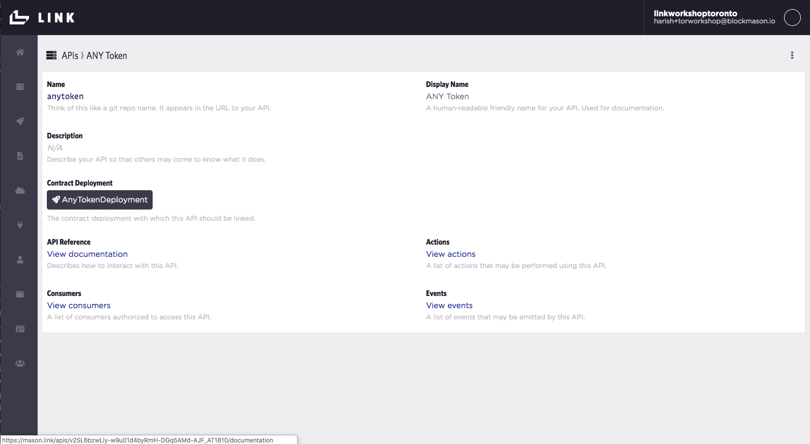
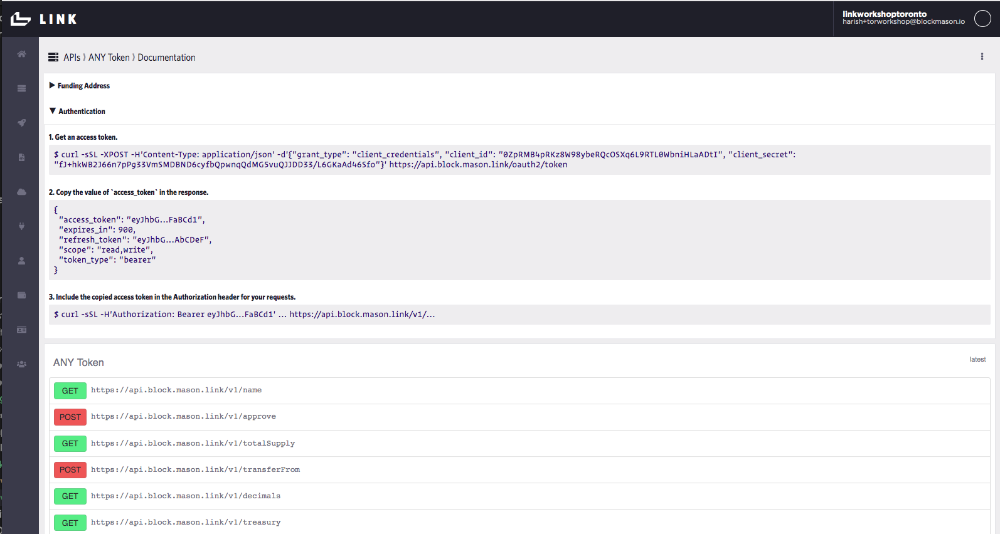
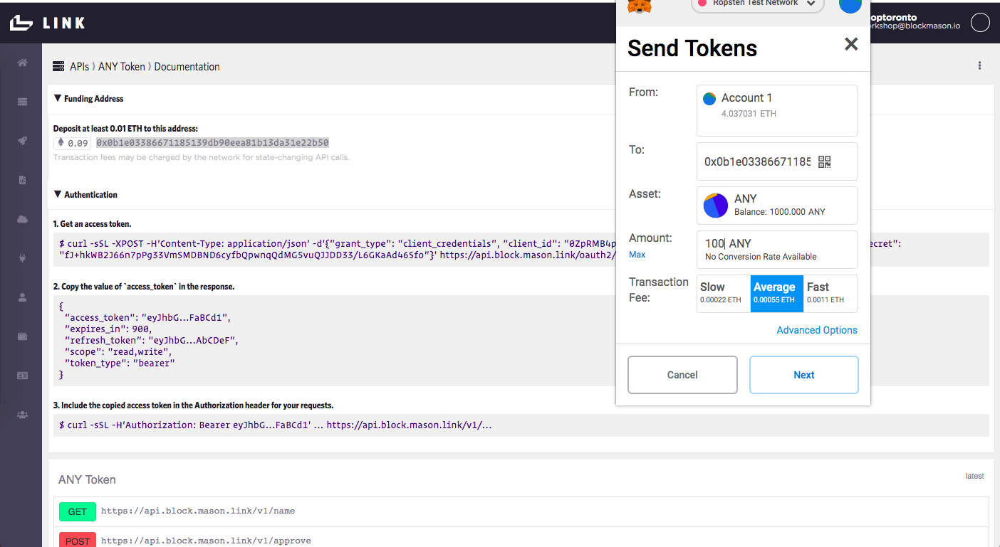
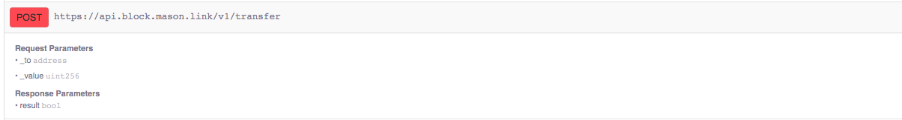

# Create your web DApp using Link (i.e. the 'easy' way) Part 2
## Goal
In this activity, we will use your custom ERC-20 token APIs generated in the previous activity to facilitate and record payments on the blockchain.

## Exercise
This activity will build upon the previous and require you to:
* Use HTML and JavaScript templates for a front-end web app that interacts with the Link smart contract APIs.
* Use Link custom token APIs to execute payment transfers on the public Ropsten network.
* Use https://ropsten.etherscan.io/ to see the details of the transaction.

## General activity notes
* While the previous activity recorded Ownership data on the Link Private Blockchain/Network, here we will use the public Ropsten blockchain and custom ERC-20 tokens to record payments. This exercise highlights the power of using Link to interact seamlessly with multiple blockchains. 

### Setup
> Navigate to your custom token API documentation in Link, which can be found as in the following screen:


Here, you can see all the available API endpoints for the custom token smart contract, as well as the authentication process with **a different `client_id` and `client_secret`**. 


> Using MetaMask, send some of your custom ERC-20 token to the Link funding address managing the payment transfer to an existing stamp owner. We explain why shortly.


> Then, uncomment the following lines in your `index.html` after `<!-- Following is for the multi-chain exercise:  -->`
```
<button class="btn btn-default btn-value" type="button" disabled="disabled">100</button>
<div style='display: inline;'>CAD</div>
```
> Lastly, again in `index.html`, change the script source from `app.js` to `app-multichain.js`. 

### Expanding the Collectible Stamps App
We will now incorporate your custom ERC-20 token into your app to record payments on the public Ropsten blockchain. The existing code from Part 1 of this activity has been slightly modified and the code to complete for Part 2 is shown in `src/js/app-multichain.js`. 

A few changes to note:
* We have 2 sets of client ID's and Secrets. This is due to the Ownership API's using one set of auth and the Token APIs using the other set. Note that the `accessToken(..)` function now takes in parameters so that we can use multiple auth credentials. 
  
* A `tokenConversionRate` is set to convert the price from your custom token to CAD on the front-end. We do this because we want the end-user to interact with our DApp just as they would with any regular web App - from their perspective, **they do not even need to know that the underlying infrastructure consists of blockchains or that payments are facilited using your custom tokens.** The end-user would pay via credit card for example, and Link then manages the payments - this is why we sent our custom ERC-20 token to Link earlier. 

* Because ownership can now be transferred (versus in the prior activity where ownership could only be set once), we will keep the `Own` button enabled. Also, since the owners array will be used in multiple places such as to 1) display the owners address below the collectible stamp as before in `markOwned()` and 2) check the existing stamp owner before transfering payment in `handleOwnership()`, we will store and update the current owners array in the `App.owners` attribute. 

* Finally, `handleOwnership()` will be broken into effectively 3 functions:
  
  1. `transferPayment()` which will execute the `POST /transfer` call to transfer your custom ERC-20 token from Link to the existing stamp owner. This transfer is recorded on the public Ropsten blockchain.
   
  2. `setOwnership()`, which like before, will record the current owner of the collectible stamp on the Link private network. 
   
  3. `handleOwnership()` which serves as the umbrella function to first check the new ownership request event is not triggered by the same owner. 

#### transferPayment function
```
transferPayment: async function(receiver, amount) {
    // To complete
},
```
Completing this function should be fairly straight-forward. We will: 
* Use the `App.clientIdToken` and `App.clientSecretToken` credentials to fetch our auth token
  
* From the Link API documentation on our custom token, we see the `POST /transfer` function takes in the `_to` address and `_value` uint256 as request parameters. Remember that the Link funding address is the set `_from` address. 


* Note the `_value` parameter passed will not simply be the "price" integer shown in `stamps.json` but rather this integer multiplied by 10^18 since we've effectively set our custom ERC-20 token to have a unit value of 1/10^18. This number is too large to be used by JavaScript so we will use the `web3.toHex(...)` function to convert the decimal to hexadecimal. 
```
"_value": web3.toHex(amount*Math.pow(10, 18))
```

* Note: the `result` object that we get back from the `POST /transfer` API call will actually be a status object that looks like this:
{
    body: (...)
    bodyUsed: false
    headers: Headers {}
    ok: true
    redirected: false
    status: 200
    statusText: "OK"
    type: "cors"
    url: "https://api.block.mason.link/v1/transfer"
}

So for now, we will have `transferPayment()` return `result['ok']` to get our bool value.

> Putting it all together, your `transferPayment()` should look similar to the following:
```
transferPayment: async function(receiver, amount) {
    const url = App.baseURL.concat('transfer');
    const token = await App.accessToken(App.clientIdToken, App.clientSecretToken);

    const reqBody = {
        "_to": receiver,
        "_value": web3.toHex(amount*Math.pow(10, 18))
    };

    try {
        const result = await fetch(url, {
            method: "post",
            headers: { 
            "Content-Type": "application/json",
            "Authorization": "Bearer " + token,
            },
            body: JSON.stringify(reqBody),
        });
        return result['ok'];
    } catch(err) {
        console.log(err);
    }
},
```
And voila! You have now incorporated the ability to facilitate payment transfers, using your very own custom ERC-20 tokens, which are recorded on the public Ropsten network! The stamp ownership continues to be recorded on the Link private network. **Your DApp is using 2 different blockchains for different purposes!!** And for the end-user, it all looks like a standard web application!


